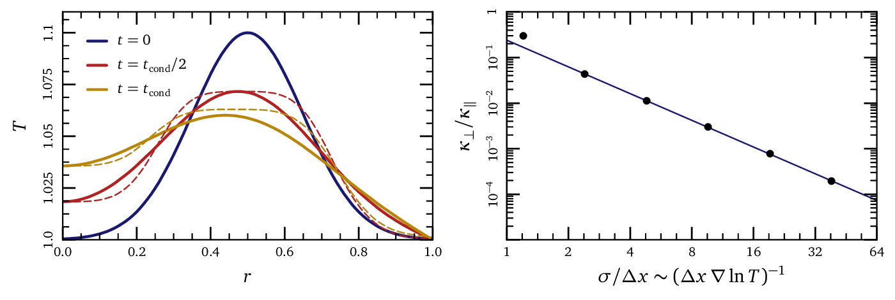

# ConductionTest

## description
This is a quantiative test of the anisotropic conduction routine in Athena.
In particular, we calculate the effective cross-field conductivity $\kappa_{\perp}/\kappa_{\parallel}$ as a function of resolution; this yields a nifty rule-of-thumb for whether or not features are resolved in Athena simulations.

To do this, we initialize a 2D simulation with circular field loops from the `field_loop test` problem, along with a circularly-symmetric, Gaussian temperature perturbation.
We also turn off the MHD integrator so that we only test the conduction routine.

With perfectly anisotropic conduction, this temperature distribution should not evolve at all; of course, heat does flow radially due to numeric errors in the code.
We want to quantify this numeric heat flux and express it as an effective cross-field conductivity.

This test thus has two parts: first, we solve the problem analytically assuming a finite cross-field conductivity.
We use the analytic solution to find the central temperature after one conduction timescale, defined as $\sigma^2/\kappa_{\perp}$.
We then run a numerical simulation until its central temperature reaches this threshold; we identify that time as the conduction timescale and use it to calculate an effective cross-field conductivity.

We show our results in `plots/conduction-convergence-study.pdf`; the first panel shows analytic and numeric temperature profiles after 0.5 and 1 conduction timescales.
The agreement is not perfect, and shouldn't be: we're comparing an analytic solution to a well-defined problem to uncontrolled numeric errors.
These errors are under no obligation to behave exactly like a diffusivity.
However, this plot does show that the numerical errors approximately behave like diffusion, and that the diffusion equation provides a useful intuition for predicting both the magnitude and the shape of numeric errors.

The right-hand panel shows the effective cross-field conductivity as a function of resolution.
We find that 8-10 cells are needed across a temperature scale-height in order to prevent spurious heat fluxes.

## reproducing our results
First, run the mathematica script in the `analytic/` directory; it should output temperature profiles at different times, along with the central temperature at different fractions of the conduction timescale.

Next, compile athena with the problem file `cond-test.c`.
Copy the `athena` binary and `athinput` file into the directory `simulation-results`.
Run the program `run.rb`; this repeatedly runs athena with different resolutions and collects results into the file `convergence.dat`.

If you use the plotting program `tioga`, you can use the script `plot.rb` to reproduce our plots.

enjoy!
